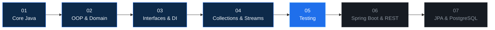
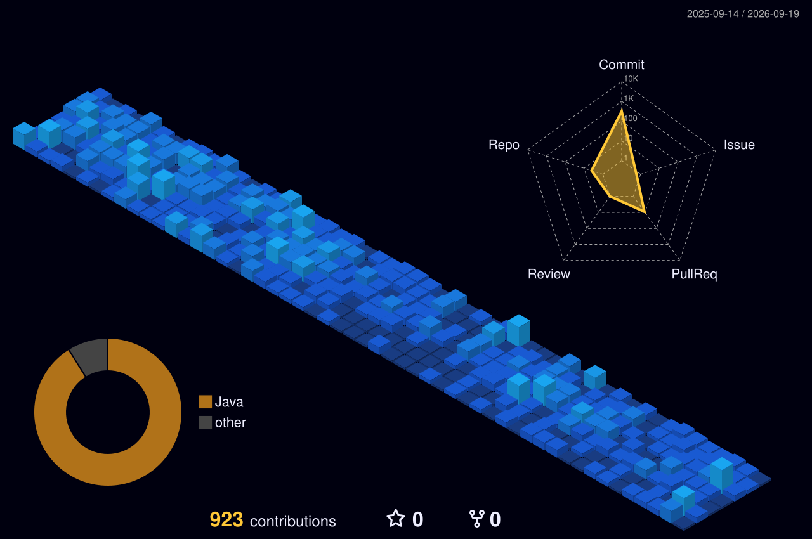

<p align="center">
  
</p>

<div align="center">


<br>


<br><br>

<code>UNDERSTAND</code>
&nbsp;→&nbsp;
<code>ANALYSE</code>
&nbsp;→&nbsp;
<code>BUILD</code>
&nbsp;→&nbsp;
<code>TEST</code>
&nbsp;→&nbsp;
<code>IMPROVE</code>

<br><br>

<a href="https://www.linkedin.com/in/steven-schwarzw%C3%A4lder-ba629433/">
  
</a>

&nbsp;

<a href="https://github.com/F1N1X">
  
</a>

</div>

<br>

## `> quick_scan`

<table>
<tr>

<td width="25%" align="center" valign="top">

### `FOCUS`

**Java Backend**

`Java`  
`Spring Boot`  
`REST APIs`

</td>

<td width="25%" align="center" valign="top">

### `BUILDING`

**Car Booking**

`Core Java`  
↓  
`Architecture`  
↓  
`Spring`

</td>

<td width="25%" align="center" valign="top">

### `STACK`

**Backend + Data**

`SQL / JPA`  
`Testing`  
`Docker`

</td>

<td width="25%" align="center" valign="top">

### `EDGE`

**Systems + Users**

`Root Cause`  
`Data Quality`  
`Customer Context`

</td>

</tr>
</table>

<div align="center">

```text
CUSTOMER CONTEXT  →  SYSTEM UNDERSTANDING  →  ENGINEERING  →  RELIABLE SOFTWARE
```

</div>

<br>

## `> whoami`

```java
public final class Steven {

    private final String alias = "F1N1X";
    private final String focus = "Java Backend Engineering";

    private final String advantage =
            "Customer Context + Systems Thinking + Engineering";

    private final String[] principles = {
            "understand first",
            "build deliberately",
            "test assumptions",
            "refactor continuously"
    };

    void evolve() {
        understand();
        analyse();
        build();
        test();
        refactor();
        improve();
    }
}
```

I'm a **backend-focused software developer** specializing in **Java and Spring**.

I combine hands-on software development experience with several years of working close to **technical systems, data, processes and customers**.

I don't only want to know whether code works.

I want to understand:

```text
Why does the problem exist?
Where does it originate?
Which systems and data are involved?
Which assumptions are we making?
How can the behavior be tested?
How can the solution remain understandable and maintainable?
```

<div align="center">

`Readable`
&nbsp;·&nbsp;
`Maintainable`
&nbsp;·&nbsp;
`Testable`
&nbsp;·&nbsp;
`Reliable`
&nbsp;·&nbsp;
`User Focused`
&nbsp;·&nbsp;
`Problem Driven`

</div>

<br>

## `> strengths`

<table>
<tr>

<td width="25%" align="center" valign="top">

### 🧠

**SYSTEM THINKING**

Understand workflows, dependencies and how individual components affect the wider system.

</td>

<td width="25%" align="center" valign="top">

### 🔍

**ROOT CAUSE ANALYSIS**

Break problems down systematically instead of treating only the visible symptom.

</td>

<td width="25%" align="center" valign="top">

### ⚙️

**PROCESS IMPROVEMENT**

Turn problems into structured, understandable and practical improvements.

</td>

<td width="25%" align="center" valign="top">

### 🤝

**COMMUNICATION**

Connect users, requirements, data and technical systems.

</td>

</tr>
</table>

<br>

My background taught me that reliable software depends on more than code.

It also depends on:

<div align="center">

`clear requirements`
&nbsp;·&nbsp;
`reliable data`
&nbsp;·&nbsp;
`good communication`
&nbsp;·&nbsp;
`traceable decisions`
&nbsp;·&nbsp;
`continuous improvement`

</div>

<br>

## `> current_mission`

### 🚗 [`car-booking`](https://github.com/F1N1X/car-booking)

> **Building a backend deliberately from the fundamentals upward — understanding the problem before adding the framework.**

`car-booking` is my current evolution project.

Instead of starting directly with Spring Boot, I am developing the system step by step — from **Core Java, domain modeling and manual dependency injection** toward automated testing, REST APIs and persistence.

### `> evolution --trace`



### `current_state`

<div align="center">


</div>

<br>

`Java`
·
`OOP`
·
`Interfaces`
·
`DAO`
·
`Constructor DI`
·
`Collections`
·
`Streams`
·
`Functional Programming`
·
`Business Logic`

### `next_iterations`

```text
JUnit 5 + Mockito
        │
        ▼
Spring Framework
        │
        ▼
Spring Boot
        │
        ▼
REST API
        │
        ▼
Spring Data JPA
        │
        ▼
PostgreSQL
        │
        ▼
Integration Testing
        │
        ▼
Docker
```

[](https://github.com/F1N1X/car-booking)
[](https://github.com/F1N1X/car-booking)
[](https://github.com/F1N1X/car-booking)

<br>

> **The goal is not only to learn how Spring works — but to understand which problems the framework solves.**

<br>

## `> selected_systems`

<table>

<tr>

<td width="50%" valign="top">

### 🛒 [`SB-eCommerce`](https://github.com/F1N1X/SB-eCommerce)

Spring Boot backend exploring common real-world application concerns such as persistence, authentication, authorization and deployment.

<br>

**Stack**

`Java`  
`Spring Boot`  
`Spring Data JPA`  
`Spring Security`  
`JWT`  
`PostgreSQL / MySQL`  
`Docker`  
`Testing`

<br>

<a href="https://github.com/F1N1X/SB-eCommerce">
  
</a>

</td>

<td width="50%" valign="top">

### 🌱 [`spring-boot-example`](https://github.com/F1N1X/spring-boot-example)

Spring Boot backend exploring REST, persistence, migrations and automated testing.

<br>

**Stack**

`Java`  
`Spring Boot`  
`Spring Data JPA`  
`Hibernate`  
`PostgreSQL`  
`Flyway`  
`JUnit 5`  
`Mockito`  
`Maven`  
`Docker`

<br>

<a href="https://github.com/F1N1X/spring-boot-example">
  
</a>

</td>

</tr>

<tr>

<td width="50%" valign="top">

### 🌐 [`food-backend`](https://github.com/F1N1X/food-backend)

Backend project exploring distributed systems, service discovery and service-to-service architecture.

<br>

**Focus**

`Java`  
`Spring`  
`Microservices`  
`Eureka`  
`Service Discovery`

<br>

<a href="https://github.com/F1N1X/food-backend">
  
</a>

</td>

<td width="50%" valign="top">

### 🧪 [`java-exercises`](https://github.com/F1N1X/java-exercises)

Structured practice for strengthening Java fundamentals through repetition, experimentation and focused challenges.

<br>

**Topics**

`OOP`  
`Generics`  
`Collections`  
`Streams`  
`Functional Interfaces`  
`Testing`

<br>

<a href="https://github.com/F1N1X/java-exercises">
  
</a>

</td>

</tr>

</table>

<br>

## `> tech_stack --inspect`

<div align="center">


</div>

<br>

### `WORKING_WITH`

<div align="center">

<table>

<tr>

<td align="center" width="25%" valign="top">

### `BACKEND`


<br><br>

`Java`  
`Spring Boot`  
`REST APIs`  
`Maven`

</td>

<td align="center" width="25%" valign="top">

### `DATA`


<br><br>

`SQL`  
`PostgreSQL`  
`MySQL`  
`JPA / Hibernate`

</td>

<td align="center" width="25%" valign="top">

### `QUALITY`


<br><br>

`JUnit 5`  
`Mockito`  
`API Testing`  
`Debugging`

</td>

<td align="center" width="25%" valign="top">

### `PLATFORM`


<br><br>

`Docker`  
`Git`  
`GitHub`  
`Linux`

</td>

</tr>

</table>

<br>


</div>

<br>

### `FOUNDATIONS`

<div align="center">

`OOP`
&nbsp;·&nbsp;
`Generics`
&nbsp;·&nbsp;
`Collections`
&nbsp;·&nbsp;
`Streams`
&nbsp;·&nbsp;
`Functional Interfaces`
&nbsp;·&nbsp;
`Dependency Injection`
&nbsp;·&nbsp;
`DAO`
&nbsp;·&nbsp;
`Service Layer`
&nbsp;·&nbsp;
`Domain Modeling`

</div>

<br>

### `PROJECT_EXPOSURE`

<div align="center">


</div>

<br>

### `PREVIOUS DEVELOPMENT EXPERIENCE`

<div align="center">


</div>

<br>

### `CURRENTLY_DEEPENING`

<div align="center">


<br>


</div>

<br>

<div align="center">

```text
Not collecting technologies.
Building understanding.
```

</div>

<br>

## `> learning_pipeline`

```text
[████████████████████] Java Fundamentals
[████████████████████] OOP & Generics
[████████████████████] Collections & Streams
[████████████████████] Maven Fundamentals

[████████████████░░░░] JUnit 5 & Mockito          ACTIVE
[██████████████░░░░░░] Spring Framework           ACTIVE
[████████████░░░░░░░░] Spring Boot                ACTIVE
[██████░░░░░░░░░░░░░░] Advanced Spring Backend    NEXT
```

> The bars visualize my **current learning path**, not self-assigned proficiency scores.

<br>

## `> experience_bridge`

<div align="center">


</div>

<br>

```text
CUSTOMER SUCCESS / DATA                       BACKEND ENGINEERING
          │                                            │
          ├── Customer Perspective                     ├── Java
          ├── Technical Troubleshooting                ├── Spring Boot
          ├── Process Analysis                         ├── REST APIs
          ├── Data Quality                             ├── Testing
          ├── Stakeholder Communication                ├── Persistence
          └── Real-World Context                       └── Databases
          │                                            │
          │                                            │
          └────────────────┐        ┌───────────────────┘
                           ▼        ▼
                    TECHNICAL PRODUCT THINKING
                              │
                              ▼
                    SOFTWARE THAT SOLVES
                       REAL PROBLEMS
```

My experience in **Customer Success, data and technically close customer environments** is not separate from software engineering.

It gives me an additional perspective.

I have worked close to the point where **users, processes, data and technical systems meet**.

That taught me to investigate what is actually happening before deciding what the solution should be.

<div align="center">

`CUSTOMER CONTEXT`
&nbsp;→&nbsp;
`ROOT CAUSE`
&nbsp;→&nbsp;
`TECHNICAL REQUIREMENT`
&nbsp;→&nbsp;
`ENGINEERING DECISION`
&nbsp;→&nbsp;
`RELIABLE SOFTWARE`

</div>

<br>

<table>

<tr>

<td width="25%" align="center" valign="top">

### `01`

**UNDERSTAND**

What is the user actually trying to achieve?

</td>

<td width="25%" align="center" valign="top">

### `02`

**TRACE**

Where do process, data and system behavior diverge?

</td>

<td width="25%" align="center" valign="top">

### `03`

**TRANSLATE**

How does the real problem become a clear technical requirement?

</td>

<td width="25%" align="center" valign="top">

### `04`

**BUILD**

How do we turn that understanding into a reliable solution?

</td>

</tr>

</table>

<br>

```text
Don't assume the problem.
Trace it.

Don't only fix the symptom.
Understand the system.

Don't build for the ticket.
Build for the actual need.
```

<br>

### `> engineering_advantage`

```text
TECHNICAL CUSTOMER EXPERIENCE
              +
       DATA AWARENESS
              +
       PROCESS THINKING
              +
     SOFTWARE ENGINEERING
              │
              ▼
     LOWER TRANSLATION LOSS
     BETTER REQUIREMENTS
     STRONGER ROOT-CAUSE ANALYSIS
     MORE PRACTICAL SOFTWARE
```

I therefore don't only ask:

> **"Does the feature work?"**

I also ask:

```text
Does it solve the actual problem?
Are the requirements clear?
Is the data reliable?
Can the behavior be reproduced?
Is the API understandable?
Can the solution be tested?
Can it still be maintained later?
What does the user experience on the other side?
```

> **Customer Success and Engineering are not separate worlds to me.  
> One taught me how to understand the problem — the other how to build the solution.**

<br>

## `> contribution_landscape`

<div align="center">



</div>

<br>

## `> developer_activity`

<div align="center">


<br><br>


</div>

<br>

## `> developer_snapshot`

<div align="center">


</div>

<br>

## `> engineering_mindset`

```text
Readable code       > Clever code
Understanding       > Copying
Testing assumptions > Guessing
Root cause          > Quick fixes
Consistency         > Motivation
Progress            > Perfection
```

I don't want to simply collect technologies.

I want to understand:

```text
how systems behave
why abstractions exist
where responsibilities belong
how failures happen
how assumptions can be tested
how code can improve over time
```

My goal is not software that is only technically interesting.

My goal is software that **solves real problems, improves processes and works reliably for the people using it.**

<br>

## `> runtime`

```text
user        Steven
alias       F1N1X

focus       Java Backend Engineering
mode        BUILDING

java        ONLINE
spring      LEARNING + BUILDING
testing     ACTIVE
systems     ANALYSING
refactoring ENABLED

customer    CONTEXT CONNECTED
data        AWARENESS ENABLED

branch      continuous-improvement
```

<br>

## `> philosophy`

<div align="center">

### `stay curious.`

**Wer aufhört zu lernen, hört auf zu wachsen.**

<br>

I want to look at code I wrote months ago and think:

### *"I know how I would build this better today."*

Because that means I learned something.

<br>

<code>Readable &gt; Clever</code>
&nbsp;·&nbsp;
<code>Understanding &gt; Copying</code>
&nbsp;·&nbsp;
<code>Consistency &gt; Motivation</code>
&nbsp;·&nbsp;
<code>Progress &gt; Perfection</code>

<br><br>

<a href="https://www.linkedin.com/in/steven-schwarzw%C3%A4lder-ba629433/">
  
</a>

<br><br>

```text
F1N1X@backend:~$ understand_problem
F1N1X@backend:~$ analyse_system
F1N1X@backend:~$ build_solution
F1N1X@backend:~$ test_assumptions
F1N1X@backend:~$ keep_improving_
```

<br>


</div>
