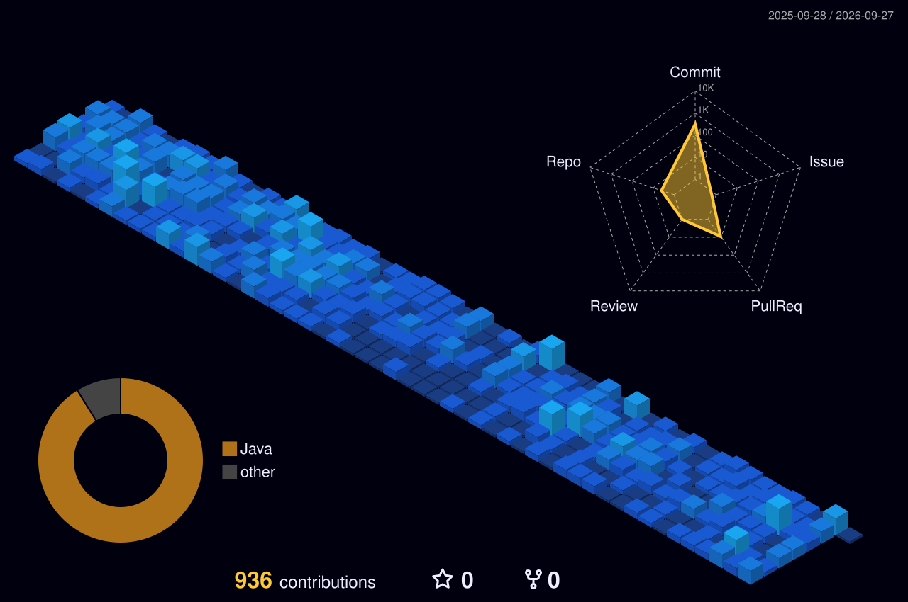

<p align="center">
  
</p>

<div align="center">


<br><br>


<br><br>


<br><br>

<code>UNDERSTAND</code>
&nbsp;→&nbsp;
<code>ANALYSE</code>
&nbsp;→&nbsp;
<code>BUILD</code>
&nbsp;→&nbsp;
<code>TEST</code>
&nbsp;→&nbsp;
<code>IMPROVE</code>

<br><br>

<a href="https://www.linkedin.com/in/steven-schwarzw%C3%A4lder-ba629433/">
  
</a>

</div>

<br>
## `> commit_stack`

<div align="center">

<!-- 3D Contribution Landscape mit den Türmen + Commit/Issue/PR Radar -->


<br><br>

<!-- Contribution Card mit Contributions, Repos und Jahresverlauf -->


</div>

## `> whoami`

```java
public final class Steven {

    private final String alias = "F1N1X";
    private final String focus = "Java Backend Engineering";

    void evolve() {
        understand();
        analyse();
        build();
        test();
        improve();
    }
}
